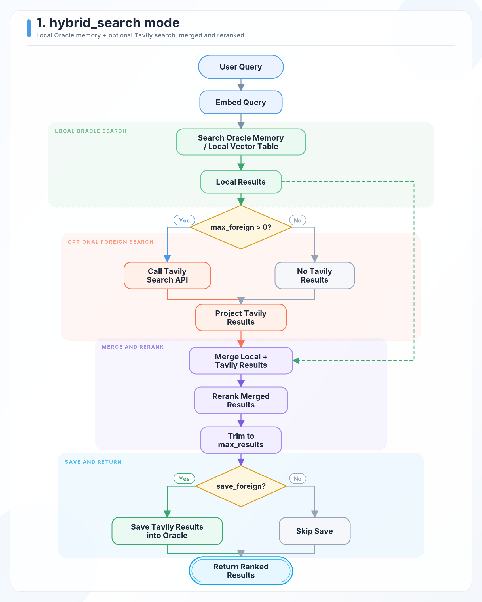
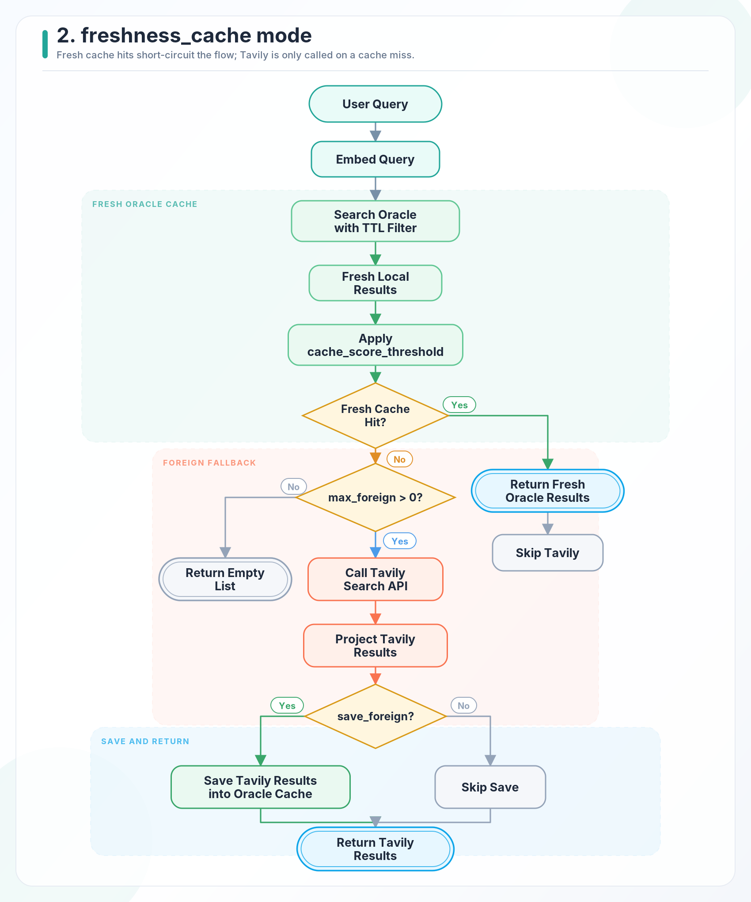
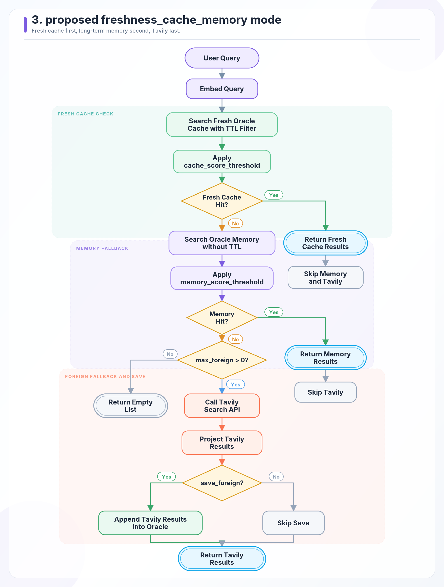

# Tavily Hybrid RAG Architecture

This document explains how `TavilyHybridClient` routes a search request across local database memory, Oracle freshness cache, Oracle durable memory, and Tavily Search. It is meant to be read alongside the Oracle guide in `examples/oracle/integration.md`.

## Mental Model

`client.search(...)` is the single application entry point. Every retrieval mode starts by embedding the user query, then decides whether to return local Oracle results, call Tavily, merge results, or write Tavily results back into Oracle.

```text
User query
  -> Embed query
  -> Search local provider rows
  -> Call Tavily only when the selected mode needs foreign results
  -> Project Tavily results into the shared result shape
  -> Merge, rerank, or short-circuit based on retrieval_mode
  -> Optionally persist Tavily results into Oracle
  -> Return result dictionaries to the caller
```

Returned rows use an origin marker:

| Origin | Meaning |
| --- | --- |
| `local` | The result came from the configured database provider, usually Oracle for these modes. |
| `foreign` | The result came from Tavily Search and was projected into the shared result shape. |

## Mode Selector

| Mode | Provider support | Search order | Tavily is called when | Best fit |
| --- | --- | --- | --- | --- |
| `hybrid_search` | MongoDB and Oracle | Local vector search, optional Tavily, merge, rerank | `max_foreign > 0` | You want fresh web context blended with local memory on every request. |
| `freshness_cache` | Oracle only | Fresh Oracle cache with TTL, Tavily fallback | Fresh cache misses and `max_foreign > 0` | You want repeated or nearby queries served from Oracle while the TTL is valid. |
| `cache_then_memory` | Oracle only | Fresh Oracle cache, durable Oracle memory, Tavily fallback | Both Oracle tiers miss and `max_foreign > 0` | You want fresh cache first, long-term memory second, and Tavily last. |

## Shared Components

| Component | Role | Main implementation |
| --- | --- | --- |
| `TavilyHybridClient.search(...)` | Orchestrates query embedding, mode dispatch, Tavily calls, ranking, and persistence. | `tavily/hybrid_rag/hybrid_rag.py` |
| `retrieval_modes` | Holds Oracle-specific routing for freshness cache and cache-then-memory. | `tavily/hybrid_rag/retrieval_modes.py` |
| Oracle provider | Executes vector search, freshness filters, metadata filters, inserts, upserts, cleanup, and vector index helpers. | `tavily/databases/oracledb/oracledb.py` |
| Embedding function | Converts query text and saved Tavily content into vectors. Defaults to Cohere helpers unless a custom callable is supplied. | `tavily/hybrid_rag/embeddings.py` |
| Ranking function | Sorts merged local and foreign candidates in `hybrid_search`. Defaults to Cohere reranking unless a custom callable is supplied. | `tavily/hybrid_rag/embeddings.py` |

## 1. `hybrid_search`

Use `hybrid_search` when the response should combine local Oracle memory with fresh Tavily results, then rerank the combined candidate set.



### Routing Rules

| Step | Behavior |
| --- | --- |
| Local lookup | Searches the configured local provider with the embedded query. For Oracle, this is vector search against the configured table. |
| Foreign lookup | Calls Tavily whenever `max_foreign > 0`, even when local results exist. |
| Merge | Projects Tavily rows into `{"content", "score", "origin"}` dictionaries, appends them to local rows, then reranks the combined list. |
| Limit | Trims the reranked list to `max_results`. |
| Save | If `save_foreign=True`, only Tavily rows are written into Oracle. Local rows are not rewritten. |

### Developer Notes

- Tavily being called repeatedly is expected in this mode when `max_foreign > 0`.
- Set `max_foreign=0` for a local-only retrieval pass.
- Use `persistence_depth="cache_plus_memory"` when saved Tavily rows should be reusable as durable memory.
- Use `enable_native_hybrid_search=True` only when the Oracle table has an Oracle Text index. The provider sanitizes the Oracle Text query and falls back to vector-only search if Oracle Text rejects it.

## 2. `freshness_cache`

Use `freshness_cache` when fresh Oracle cache hits should short-circuit the request and avoid a Tavily call.



### Routing Rules

| Step | Behavior |
| --- | --- |
| Fresh cache lookup | Searches Oracle rows inside `cache_ttl_seconds` using the configured cache timestamp field. |
| Threshold | Keeps only rows with `score >= cache_score_threshold`. |
| Cache hit | Returns fresh local cache rows immediately and skips Tavily. |
| Cache miss | Calls Tavily only when `max_foreign > 0`; otherwise returns an empty list. |
| Save | If `save_foreign=True`, Tavily rows can be saved back into Oracle for future cache hits. |

### Developer Notes

- This mode is Oracle-only.
- The default cache timestamp field is `ADDED_AT`.
- Use `persistence_depth="cache_only"` when the rows should expire as cache.
- If cache always misses, check `ADDED_AT`, `cache_ttl_seconds`, and `cache_score_threshold`.
- If `max_foreign=0` and the cache misses, the correct response is an empty list.

## 3. `cache_then_memory`

Use `cache_then_memory` when the client should prefer fresh cache rows, then durable memory rows, and call Tavily only as the final fallback. The infographic uses an earlier proposal label, `freshness_cache_memory_mode`; the implemented SDK mode string is `cache_then_memory`.



### Routing Rules

| Step | Behavior |
| --- | --- |
| Fresh cache lookup | Searches Oracle rows inside `cache_ttl_seconds`. Both `cache_only` and `cache_plus_memory` rows can satisfy the cache tier. |
| Cache threshold | Keeps only rows with `score >= cache_score_threshold`. |
| Cache hit | Returns fresh cache rows immediately and skips memory plus Tavily. |
| Memory lookup | On cache miss, searches Oracle again without the TTL filter. This tier is limited to `cache_plus_memory` rows by `MEMORY_SCOPE`. |
| Memory threshold | Keeps only rows with `score >= memory_score_threshold`. |
| Memory hit | Returns durable memory rows immediately and skips Tavily. |
| Full miss | Calls Tavily only when `max_foreign > 0`; otherwise returns an empty list. |
| Save | If `save_foreign=True`, Tavily rows can be appended or upserted into Oracle. When omitted, `persistence_depth` defaults to `cache_plus_memory` in this mode so saved rows can survive cache expiry. |

### Developer Notes

- This mode is Oracle-only.
- The client enables Oracle memory metadata internally for this mode, so the table must include `MEMORY_SCOPE`, `EXPIRES_AT`, `LAST_SEEN_AT`, and `QUERY_COUNT`.
- `memory_max_results` controls how many durable memory rows are inspected; when omitted, the memory tier uses `max_local`.
- If memory does not recover after cache expiry, confirm rows were saved with `persistence_depth="cache_plus_memory"` and that `memory_score_threshold` is not too high.

## Persistence Model

`save_foreign=True` is a write-through path for Tavily results. It runs after Tavily returns results and before the final response is handed back.

```text
Tavily results
  -> optional persistence filtering
  -> embed result content as search_document
  -> build Oracle metadata
  -> insert, upsert, or skip duplicates
```

| Control | What it changes |
| --- | --- |
| `save_foreign` | Enables persistence when set to `True`, or allows a custom transform function. |
| `persistence_depth` | Writes rows as `cache_only` or `cache_plus_memory` when Oracle memory metadata is enabled, or automatically in cache modes when the table has lifecycle columns. Defaults to `cache_plus_memory` for `cache_then_memory`. |
| `max_persisted_foreign` | Caps how many Tavily rows are saved per search. |
| `persist_score_threshold` | Saves only Tavily rows above the configured Tavily score threshold. |
| `dedup_similarity_threshold` | Skips near-duplicate Oracle inserts by vector similarity. |
| `oracle_upsert_key` | Updates existing rows by `source_url` or `content_hash` instead of repeatedly inserting. |
| `auto_cleanup_cache` | Runs expired cache-managed cleanup before searches, rate-limited by `cache_cleanup_interval_seconds`. |

Minimum Oracle storage needs content, embeddings, and a timestamp column. Full cache and memory behavior is easier to inspect when these optional columns exist:

| Column | Purpose |
| --- | --- |
| `RAW_PAYLOAD` | Stores the raw Tavily result payload when JSON payload storage is enabled. |
| `SOURCE_URL`, `SOURCE_TITLE` | Preserve source identity for review and upsert workflows. |
| `RETRIEVAL_QUERY`, `RETRIEVAL_MODE` | Record why the row was written. |
| `CACHE_HIT`, `INSERTED_FROM`, `PROVIDER_NAME` | Preserve provenance for debugging and reporting. |
| `MEMORY_SCOPE` | Separates `cache_only` rows from `cache_plus_memory` rows. |
| `EXPIRES_AT`, `LAST_SEEN_AT`, `QUERY_COUNT` | Track cache expiry and reuse lifecycle. |
| `CONTENT_HASH` | Supports content-based upsert or deduplication. |

## Configuration Cheat Sheet

| Option | Default | Use it when |
| --- | --- | --- |
| `retrieval_mode` | `"hybrid_search"` | You need to choose merge, cache, or cache-then-memory behavior. |
| `max_local` | `max_results` | You want to inspect more or fewer local rows before ranking or thresholding. |
| `max_foreign` | `max_results` | You want to cap or disable Tavily calls. Set `0` to skip Tavily. |
| `cache_ttl_seconds` | `86400` | You need a shorter or longer fresh-cache window. |
| `cache_score_threshold` | `0.0` | You only want high-confidence cache hits. |
| `memory_score_threshold` | `0.0` | You only want high-confidence durable memory hits. |
| `memory_max_results` | `None` | You want the memory tier to inspect a different number of rows than `max_local`. |
| `enable_oracle_memory_metadata` | `False` | You want lifecycle columns such as `MEMORY_SCOPE`, `EXPIRES_AT`, and `QUERY_COUNT`; `cache_then_memory` enables this internally. |
| `enable_oracle_json_payload` | `False` | You want raw Tavily payloads stored in Oracle. |
| `enable_provenance_metadata` | `False` | You want reviewable source, query, provider, mode, and cache-hit columns. |

## Debugging Checklist

| Symptom | Check |
| --- | --- |
| Tavily keeps getting called in `hybrid_search` | This is expected when `max_foreign > 0`. |
| Tavily is not called on a fresh cache hit | This is expected in `freshness_cache` and `cache_then_memory`. |
| Cache mode returns `[]` | Confirm whether the cache missed and `max_foreign` was set to `0`. |
| Cache always misses | Check `ADDED_AT`, the TTL window, `cache_score_threshold`, and whether the table has embeddings. |
| Memory fallback does not hit | Check `persistence_depth="cache_plus_memory"`, memory metadata columns, `memory_score_threshold`, and `memory_max_results`. |
| Save fails with missing columns | Add the optional metadata columns required by the features you enabled. |
| Duplicate rows grow too quickly | Configure `oracle_upsert_key`, `dedup_similarity_threshold`, `max_persisted_foreign`, or `persist_score_threshold`. |
| Native Oracle hybrid search silently behaves like vector search | Confirm the Oracle Text index exists. If Oracle Text rejects a sanitized query, the provider falls back to vector-only search to keep retrieval working. |

## Quick Implementation Map

| Task | Start here |
| --- | --- |
| Change mode routing | `tavily/hybrid_rag/retrieval_modes.py` |
| Change shared search orchestration | `tavily/hybrid_rag/hybrid_rag.py` |
| Change Oracle SQL, filters, inserts, upserts, or cleanup | `tavily/databases/oracledb/oracledb.py` |
| Change Oracle option defaults or field names | `tavily/databases/oracledb/oracle_config.py` |
| Run behavior-focused tests | `tests/test_hybrid_rag_oracle.py` |
| Try the runnable guide | `examples/oracle/integration.md` |
